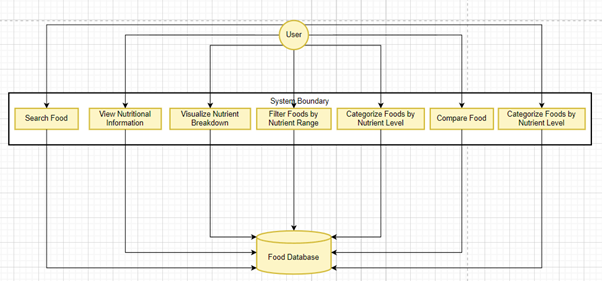
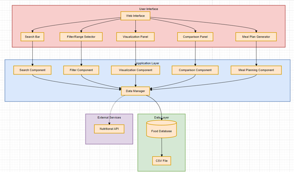
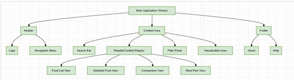


# Software Design Document

## Project Name: Nutritional Food Database Analysis and VisualiSation Tool
# Group Number: 02

## Team members

| Student Number | Name      |
|----------------|-----------|
| s2817538       | Kate Baker |
| s5374957       | I Wibawa |
| s5414931       | Naveen Arakkal Nelson |
## Table of Contents

1. [System Vision](#1-system-vision)  
    1.1 [Problem Background](#11-problem-background)  
    1.2 [System Capabilities/Overview](#12-system-capabilitiesoverview)  
    1.3 [Potential Benefits](#13-potential-benefits)  

2. [Requirements](#2-requirements)  
    2.1 [User Requirements](#21-user-requirements)  
    2.2 [Software Requirements](#22-software-requirements)  
    2.3 [Use Case Diagrams](#23-use-case-diagrams)  
    2.4 [Use Cases](#24-use-cases)  

3. [Software Design and System Components](#3-software-design-and-system-components)  
    3.1 [Software Design](#31-software-design)  
    3.2 [System Components](#32-system-components)  
        - 3.2.1 [Functions](#321-functions)  
        - 3.2.2 [Data Structures / Data Sources](#322-data-structures--data-sources)  
        - 3.2.3 [Detailed Design](#323-detailed-design)  

   
4. [User Interface Design](#4-user-interface-design)  
    4.1 [Structural Design](#41-structural-design)  
    4.2 [Visual Design](#42-visual-design)  

## 1. System Vision

### 1.1 Problem Background

- Problem Identification: The system addresses the challenge of making informed dietary choices due to the complexity of nutritional data and the lack of user-friendly tools to analyze this information.

- Dataset: The system uses the Comprehensive Nutritional Food Database, which provides detailed nutritional information for a wide range of food items.

- Data Input/Output:
  - Input: User queries for food items, nutritional ranges, and dietary preferences.
  - Output: Nutritional information, visualizations, filtered food lists, and meal plans.

- Target Users: The system targets health-conscious individuals, dieters, nutritionists, and dietitians who need to analyze and understand nutritional information for various foods.

### 1.2 System capabilities/overview

- System Functionality: The system will provide a user-friendly interface for analyzing and visualizing nutritional data from the Comprehensive Nutritional Food Database.

- Features and Functionalities:
  1. Search for foods by name and view comprehensive nutritional information
  2. Visualize nutrition breakdowns using pie charts and bar graphs
  3. Filter foods based on specific nutritional content ranges
  4. Categorize and filter foods by nutritional levels (low, mid, high)
  5. Compare multiple food items side-by-side
  6. Generate personalized daily meal plans based on user-defined nutritional goals and preferences

### 1.3 Benefit Analysis

- Improved dietary decision-making through easy access to comprehensive nutritional information
- Enhanced understanding of nutritional content in various foods through visual representations
- Easier comparison of different food items, supporting more informed food choices
- Support for meal planning and diet management
- Potential use in educational settings to teach about nutrition
- Empowerment of users to make data-driven decisions about their diet and health
- Timesaving for nutritionists and dietitians in analyzing and presenting food nutritional data

## 2. Requirements

### 2.1 User Requirements

1. Users shall be able to search for foods by entering names in a search bar.
2. Users shall view detailed nutritional information for selected foods, including macronutrients, vitamins, and minerals.
3. Users shall visualize nutritional breakdowns through interactive pie charts and bar graphs.
4. Users shall filter foods by setting specific nutritional ranges (e.g., protein content between 10g and 20g per 100g).
5. Users shall categorize and filter foods by nutritional content levels (low, mid, high) for fat, protein, carbohydrates, sugar, and nutritional density.
6. Users shall compare multiple food items side-by-side in a comparison view.
7. Users shall generate personalized daily meal plans by inputting their nutritional goals and preferences.

Note: Since no specific client or user is assigned, we envision the primary users of this software to be health-conscious individuals, dieters, nutritionists, and dietitians who need to analyze and understand nutritional information for various foods quickly and efficiently.

### 2.2 Software Requirements

- R1.1 The system shall provide a search functionality for foods in the database.
- R1.2 The system shall display comprehensive nutritional information for each food item.
- R1.3 The system shall generate pie charts and bar graphs for nutrient breakdowns.
- R1.4 The system shall allow users to set minimum and maximum values for nutritional content filtering.
- R1.5 The system shall categorize foods into low, mid, and high levels for fat, protein, carbohydrates, sugar, and nutritional density.
- R1.6 The system shall have a graphical user interface for all interactions.
- R1.7 The system shall load and process data from the provided CSV file.
- R1.8 The system shall provide a comparison view for multiple selected food items.
- R1.9 The system shall generate personalized meal plans based on user-defined nutritional goals and preferences.
- R1.10 The system shall ensure all calculations and data presentations are accurate to two decimal places.
- R1.11 The system shall respond to user interactions within 2 seconds under normal operating conditions.

### 2.3 Use Case Diagrams

### 2.4 Use Cases

| Use Case ID | Use Case Name | Actors | Description | Flow of Events | Alternate Flow |
|-------------|---------------|--------|-------------|-----------------|----------------|
| UC001 | Search Food | User | User searches for a specific food item in the database | 1. User enters food name in the search bar 2. System processes the search query 3. System displays a list of matching food items 4. User selects a specific food item 5. System displays detailed nutritional information for the selected item | If no matching items are found, the system displays a "No results found" message |
| UC002 | View Nutritional Information | User | User views detailed nutritional information for a selected food item | 1. User selects a food item from the search results or a list 2. System retrieves the nutritional data for the selected food 3. System displays comprehensive nutritional information including calories, macronutrients, vitamins, and minerals 4. User can scroll or navigate through the information | None |
| UC003 | Visualize Nutrient Breakdown | User | User views graphical representation of a food's nutritional content | 1. User selects "Visualize" option for a food item 2. System generates a pie chart showing macronutrient breakdown (fat, protein, carbohydrates) 3. System generates a bar graph showing micronutrient content 4. System displays both visualizations to the user | None |
| UC004 | Filter Foods by Nutrient Range | User | User filters food database based on specific nutrient ranges | 1. User selects a nutrient (e.g., protein) 2. User inputs minimum and maximum values for the selected nutrient 3. System filters the food database based on the input range 4. System displays the list of foods that fall within the specified range | If no foods match the criteria, system displays "No foods found within the specified range" |
| UC005 | Categorize Foods by Nutrient Level | User | User filters foods based on low, mid, or high levels of specific nutrients | 1. User selects a nutrient (fat, protein, carbohydrates, sugar, or nutritional density) 2. User chooses a level (low, mid, or high) 3. System categorizes foods based on the selected criteria 4. System displays the list of foods in the chosen category | If no foods match the criteria, system displays "No foods found in this category" |
| UC006 | Compare Foods | User | User compares nutritional information of multiple selected food items side-by-side | 1. User selects multiple food items for comparison 2. User chooses "Compare" option 3. System retrieves nutritional data for all selected items 4. System displays a side-by-side comparison of nutritional information | None |
| UC007 | Generate Meal Plan | User | User generates a personalized meal plan based on nutritional goals and preferences | 1. User inputs nutritional goals and dietary preferences 2. User specifies the number of meals per day 3. System processes the input and searches the database 4. System generates a meal plan meeting the specified criteria 5. System displays the meal plan to the user | If no suitable meal plan can be generated, system suggests adjustments to the user's input |

## 3. Software Design and System Components

### 3.1 Software Design

Component Breakdown:

1. User Interface:
   - Web Interface: The main user interaction point
   - Search Bar: For food item searches
   - Filter/Range Selector: For applying nutritional filters
   - Visualization Panel: For displaying charts and graphs
   - Comparison Panel: For side-by-side food comparisons
   - Meal Plan Generator: Interface for creating meal plans

2. Application Layer:
   - Search Component: Handles food search functionality
   - Filter Component: Manages filtering and categorization
   - Visualization Component: Generates charts and graphs
   - Comparison Component: Processes food comparisons
   - Meal Planning Component: Generates meal plans
   - Data Manager: Central component for data handling and communication with the data layer

3. Data Layer:
   - Food Database: Stores all food and nutritional information
   - CSV File: The source of the nutritional data

4. External Services:
   - Nutritional API: Optional external service for additional nutritional data (shown with a dotted line to indicate it's not a core component)

### 3.2 System Components

#### 3.2.1 Functions

1. search_food(query: str) -> List[FoodItem]
   - Description: Searches for food items based on user input
   - Input Parameters: query (string) - The search term entered by the user
   - Return Value: A list of FoodItem objects matching the search query

2. generate_nutrition_chart(food_item: FoodItem) -> Chart
   - Description: Creates a visual representation of the nutritional breakdown
   - Input Parameters: food_item (FoodItem) - The selected food item
   - Return Value: A Chart object containing the visualization

3. filter_foods_by_nutrient(nutrient: str, min_value: float, max_value: float) -> List[FoodItem]
   - Description: Filters foods based on a specific nutrient range
   - Input Parameters:
     1. nutrient (string) - The nutrient to filter by
     2. min_value (float) - The minimum value of the nutrient
     3. max_value (float) - The maximum value of the nutrient
   - Return Value: A list of FoodItem objects that fall within the specified range

4. categorize_foods_by_nutrient_level(nutrient: str, level: str) -> List[FoodItem]
   - Description: Categorizes foods based on low, mid, or high levels of a specific nutrient
   - Input Parameters:
     1. nutrient (string) - The nutrient to categorize by
     2. level (string) - The level to filter (low, mid, or high)
   - Return Value: A list of FoodItem objects in the specified category

5. compare_foods(food_items: List[FoodItem]) -> ComparisonResult
   - Description: Compares multiple food items
   - Input Parameters: food_items (List[FoodItem]) - A list of FoodItem objects to compare
   - Return Value: A ComparisonResult object containing the comparison data

#### 3.2.2 Data Structures / Data Sources

1. FoodItem
   - Type: Class
   - Usage: Represents a single food item with all its nutritional information
   - Attributes:
     - name: str
     - calories: float
     - protein: float
     - carbohydrates: float
     - fats: float
     - vitamins: Dict[str, float]
     - minerals: Dict[str, float]
   - Methods:
     - get_nutrient_value(nutrient: str) -> float

2. NutritionalDatabase
   - Type: Class
   - Usage: Manages the entire database of food items
   - Attributes:
     - food_items: List[FoodItem]
   - Methods:
     - load_data(file_path: str)
     - search_food(query: str) -> List[FoodItem]
     - apply_filters(filters: Dict[str, Any]) -> List[FoodItem]

3. Chart
   - Type: Class
   - Usage: Represents a visualization of nutritional data
   - Attributes:
     - chart_type: str
     - data: Dict[str, Any]
   - Methods:
     - render() -> Image

4. ComparisonResult
   - Type: Class
   - Usage: Represents the result of a food comparison
   - Attributes:
     - food_items: List[FoodItem]
     - comparison_data: Dict[str, List[float]]

#### 3.2.3 Detailed Design
1. search_food
   - 
2. generate_nutrition_chart
   - 
3. filter_foods_by_nutrient
   - 
4. categorise_foods_by_nutrient_level
   - 
5. compare_foods
   - 

## 4. User Interface Design

### 4.1 Structural Design

Structure:
- The software will be structured with a main application window containing a header, content area, and footer.
- The content area will be the primary focus, housing the search functionality, results display, and various views for detailed information and comparisons.

Information Grouping:
- Information will be organized into distinct sections within the content area.
- This includes a search bar for user input, a results display area that can show different views (food list, detailed food information, comparisons, and meal plans), a filter panel for refining searches, and a visualization area for graphical representation of nutritional data.

Navigation:
- Users will navigate through the software primarily using the navigation menu in the header and through interactive elements within the content area.
- The search bar will be the starting point for most user interactions, with results leading to more detailed views.
- Users can move between different views (e.g., from food list to detailed view) through clickable elements within the interface.

Design Choices:
These design choices were made to create an intuitive and efficient user experience:
1. The hierarchical structure allows for clear organization of features and information.
2. Placing the search bar prominently encourages users to start their interaction with a search.
3. The filter panel alongside the results allows for easy refinement of searches.
4. Separating different views (list, detailed, comparison, meal plan) allows for focused presentation of information without overwhelming the user.
5. Including a visualization area enables quick understanding of nutritional data through graphical representations.
6. The footer provides easy access to supplementary information (About and Help) without cluttering the main interface.

### 4.2 Visual Design

[Insert your UI mockups here]

1. Main search screen
   - 
2. Detailed food information view
   - 
3. Nutrition breakdown visualization
   - 
4. Filter settings screen
   - 
